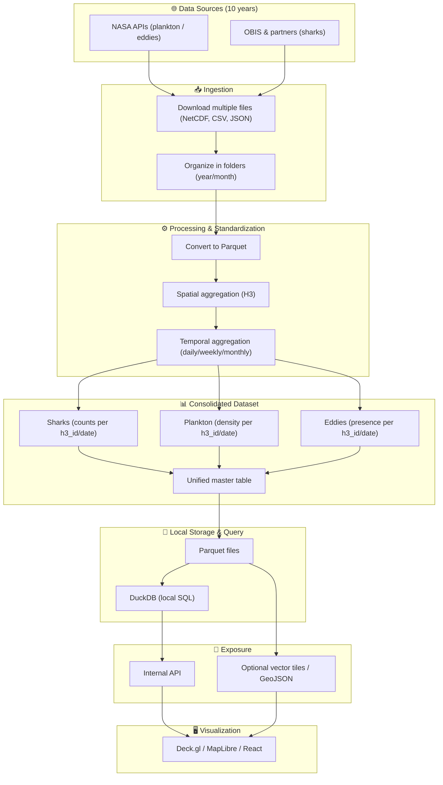

# SharkSense – Global Shark Intelligence Platform

SharkSense is our submission for the **NASA Space Apps 2025 Hackathon**. The goal is to build a unified platform that ingests, processes, and visualizes a decade of oceanographic and biological observations so researchers can understand where sharks are most likely to appear and why. The project combines data engineering, interactive 3D visualization, Smart Tag concepts, and a generative AI copilot capable of manipulating the globe in natural language.

## Why Sharks (and Smart Tags) Matter

- Sharks are apex indicators of ocean health; tracking them helps us protect entire ecosystems.
- Smart Tags allow us to collect temperature, depth, acceleration, and GPS data that feeds conservation decisions.
- We transform raw satellite feeds and historical encounters into global H3-indexed probability maps that can be explored in real time.

## Hackathon Mission

- **Challenge:** deliver a research-grade tool that turns scattered archives (NASA, OBIS, other partners) into actionable, explainable insights.
- **Team Focus:** end-to-end pipeline – acquisition → processing → predictive modeling → interactive exploration → AI assistant.

## Data Sources (2015 – present)

- **NASA Earth Observation APIs** – Chlorophyll (plankton) and Sea Surface Height/Eddies (NetCDF, CSV).
- **NOAA/NASA SST products** – Nightly & monthly composites (NetCDF).
- **OBIS & complementary biodiversity archives** – Shark sightings and tag downloads.
- **SWOT**, **MODIS/Aqua**, **Landsat derived products** – additional ocean dynamics.

All datasets are indexed under a consistent H3 resolution (r5 ≈ 25 km) so ecological layers can be compared in the same spatial footprint.

## Download & Processing Pipeline

1. **Acquisition scripts** (`download_full_*.py`) pull NetCDF/CSV/JSON files from NASA and OBIS APIs, organized by `downloads/<dataset>/<year>/<month>`.
2. **Conversion** – raw files are converted to Parquet, keeping metadata in DuckDB/Arrow for fast local SQL.
3. **Spatial aggregation** – each observation is mapped to an H3 cell; statistics such as mean SST or shark count per day are computed.
4. **Temporal aggregation** – values are rolled up to daily/weekly/monthly series depending on the layer.
5. **Predictive engine** – a gradient boosted ensemble is trained per species using the last 10 years of data. Outputs are stored as H3-indexed CSVs for the viewer.
6. **Serving** – Parquet files + DuckDB serve local analysis; CSV predictions are published to S3 and consumed by the web client.

## Visualization (Web)

- **MapLibre + deck.gl** render the Earth as a 3D globe with layer toggles, opacity controls, and H3 overlays.
- **Smart Tag 3D showcase** demonstrates how sensor payloads feed the model (React Three Fiber).
- **Prediction Engine tab** documents the full modeling pipeline, metrics, and roadmap.
- Everything is typed with TypeScript and bundled with Vite for fast iteration.

## Generative AI Copilot

- Chat panel supports **Chat** and **Agent** modes.
- In agent mode, the frontend sends `mode`, message, user location, current filters, and viewport to an n8n API.
- The LLM returns `reply + commands[]`. Supported commands: `toggle-layer`, `set-layer-opacity`, `filter-shark-species`, `filter-prediction-species`, `clear-*`, `highlight-area`, `focus-bounds`, `plot-h3`, `clear-plot`.
- Commands are validated and executed in the UI, enabling voice-like interaction (e.g., “show predicted sharks along the Brazilian coast”).

## Smart Tag System

- Titanium housing, multi-sensor stack (temperature, depth, acceleration), GPS uplink, energy harvesting.
- Data cadence: GPS every 15 minutes, env sensors every 5 seconds, acceleration continuous.
- Encrypted storage + satellite/acoustic retrieval feed the model.
- 3D demo highlights each sensor and describes conservation use cases.

## Tech Stack

- **Frontend:** React 18, Vite, TypeScript, Tailwind, Framer Motion, MapLibre GL JS, deck.gl, React Three Fiber, Three.js.
- **Mapping/Indexing:** H3-js, DuckDB, Parquet/Arrow.
- **Data Scripts:** Python 3.11 (xarray, pandas, geopandas, pyarrow).
- **AI/Automation:** OpenAI API (via n8n), Redis caching, S3 storage.
- **Deployment:** Vercel for the web app, AWS S3 + CloudFront for datasets.

## Getting Started

```bash
# Install dependencies
npm install

# Run the web client
yarn dev  # or npm run dev

# Build for production
npm run build
```

### Running data scripts

```bash
# Download plankton archive
python download_full_plancton.py

# Convert NetCDF/CSV to Parquet
python extract_data_nc.py
```

Scripts use environment variables (`.env`) for API keys and date ranges. See each script header for details.

## Project Flow (Mermaid)



## Roadmap

- Connect the chat agent to the production flow with OpenAI function-calling.
- Publish daily prediction CSVs to S3 automatically.
- Add Smart Tag telemetry replay and alerts.
- Expand to more species (Carcharhinus, Galeocerdo, Prionace, Carcharodon).

## Contributing

PRs and issues are welcome! Please open a ticket describing the feature or fix before submitting a pull request.

---

Built with 💙 for the oceans and NASA Space Apps Challenge 2025.
